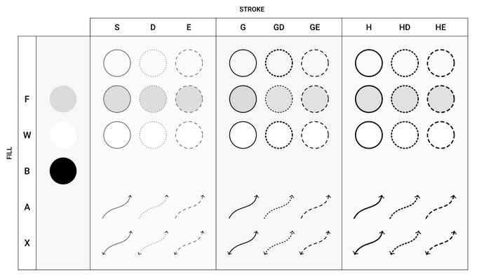

# Inkscape Shortcut Manager

[Português (Brasil)](/README.pt-BR.md)

Draw mathematical figures in Inkscape with composable styles, reusable objects, and text or formulas written in your editor.

This fork adapts [Gilles Castel's Inkscape Shortcut Manager](https://github.com/gillescastel/inkscape-shortcut-manager) for a workflow using **Hyprland, XWayland, and Obsidian**. The main interaction change is a *leader* key: press **Space** and type the components of a style in sequence, without holding several keys at once.

The project is inspired by Gilles Castel's article **[How I draw figures for my mathematical lecture notes using Inkscape](https://castel.dev/post/lecture-notes-2/)**. The article introduces the original idea of combining shortcuts, styles, and objects to keep up with taking lecture notes.

## Quick start

After installing the dependencies, open a figure with the launcher:

```sh
./inkscape-managed /path/to/figure.svg
```

In Inkscape:

1. Draw and select an object.
2. Press **Space**, release it, then **d**, release it, then **a**.
3. Press **Enter** or wait **1 second**: the object receives a dotted stroke with an arrowhead.
4. Press **a** to search for and insert a saved object, or **s** to apply a saved style.

The launcher starts the manager automatically. You do not need another terminal or an autostart entry for this workflow.

## Compatibility and installation

The manager intercepts keyboard events from **X11** windows. In a Wayland session, Inkscape must run through **XWayland**; intercepting native Wayland windows is not supported.

The launcher sets `GDK_BACKEND=x11` only for Inkscape and uses `--app-id-tag=shortcutmanager` to avoid reusing an existing Wayland instance. The rest of the desktop keeps using its usual backend.

This revision was validated on CachyOS, Hyprland 0.56.2, Inkscape 1.4.4, and Python 3.14. Other X11 environments may work, but the workspace rule is specific to Hyprland.

### Dependencies

| Feature | Dependencies |
|---|---|
| Shortcuts, styles, and objects | Python 3, `python-xlib`, Inkscape, `xclip`, and Rofi |
| Use in a Wayland session | XWayland available in the compositor |
| Default text editor | Kitty and Neovim; both can be replaced in the configuration |
| Rendered formulas | `pdflatex`, `pdf2svg`, and the LaTeX packages used by the template |

On Arch Linux and CachyOS, install the main dependencies with:

```sh
sudo pacman -S --needed python python-xlib inkscape xorg-xwayland xclip rofi
```

To use the default editor and convert PDF to SVG:

```sh
sudo pacman -S --needed kitty neovim pdf2svg
```

For `Shift+t`, also install a LaTeX distribution with `pdflatex`. The default template uses `standalone`, `inputenc`, `fontenc`, `textcomp`, `amsmath`, and `amssymb`. These LaTeX dependencies are not required for drawing, applying styles, or reusing objects.

### Getting and running the project

Clone your fork or download the repository and enter the `inkscape-shortcut-manager` directory. From there:

```sh
chmod +x inkscape-managed
python3 main.py --doctor
./inkscape-managed
```

Without a file path, the launcher opens Inkscape to create a document. To edit an existing figure, provide its path, using quotes if it contains spaces:

```sh
./inkscape-managed "/path/to figures/electric-field.svg"
```

The `inkscape-managed` script uses `/usr/bin/python3`. The `Xlib` library must be available to that interpreter. To use a virtual environment, run `python launch.py figure.svg` with that environment's Python.

## Styles with the leader key

**Space** starts a style sequence. Then type the letters you want **one at a time, in lowercase**.

- The default timeout is **1 second**, renewed when you release each letter.
- **Enter** applies the combination immediately.
- **Esc** cancels without applying it.
- **Backspace** clears the combination so you can start again.
- Switching focus to another window cancels the sequence.

For example, `Space → g → d → a → Enter` creates a thick dotted arrow. The `→` symbols in this documentation indicate the order of the keys; do not type them.

### Visual guide



The uppercase letters in the image are **labels**, not Shift commands. For example, column **GD** corresponds to `Space → g → d`; row **F** in that column adds `f` to the sequence. Rows **A** and **X** represent arrowheads, even though they are grouped alongside the fills on the left.

| Letter after Space | Effect |
|---|---|
| `s` | Thin, solid black stroke |
| `d` | Dotted stroke |
| `e` | Dashed stroke |
| `g` | Thick stroke |
| `h` | Very thick stroke |
| `a` | Arrowhead at the end of the path |
| `x` | Arrowheads at both ends |
| `f` | Black fill at 12% opacity, appearing gray over white |
| `w` | White fill |
| `b` | Black fill |

### Combination examples

| Sequence | Result |
|---|---|
| `Space → s → Enter` | Thin stroke, no fill |
| `Space → d → a → Enter` | Dotted arrow |
| `Space → g → e → x → Enter` | Thick dashed line with arrowheads at both ends |
| `Space → f → s → Enter` | Gray fill and thin stroke |
| `Space → f → d → Enter` | Gray fill and dotted stroke |
| `Space → w → h → Enter` | White fill and very thick stroke |
| `Space → b → Enter` | Black fill, no stroke |

Generated styles reset the fill, stroke, dash pattern, and markers; they do not just change a single property in isolation. Without a fill letter, the fill is removed. Without a stroke letter, the stroke is removed. In the current implementation, `f`, `w`, and `b` also remove arrowheads: use fills for shapes and `a`/`x` for paths with arrowheads.

The original project's simultaneous key chords are still available: for example, hold `d` and `a`, then release both to apply the style. Leader mode provides an alternative for more comfortable typing.

## Normal-mode shortcuts

Use these shortcuts **without pressing Space first**. The same letter may have a different meaning inside a style sequence.

| Key | Action |
|---|---|
| `Space` | Start a style sequence |
| `a` | Open the saved objects menu |
| `s` | Open the saved styles menu |
| `Shift+a` | Save the selected objects |
| `Shift+s` | Save the selection's style |
| `w` | Activate the Pencil tool |
| `f` | Activate the Bézier tool |
| `x` | Toggle snapping |
| `z` | Undo |
| `Shift+z` | Delete the selection |
| `t` | Open the editor and insert its contents as text |
| `Shift+t` | Open the editor, compile LaTeX, and insert the rendered SVG |
| `F12` | Enter or leave direct text mode |

Shortcuts using Ctrl, Alt, Super, and AltGr remain available to Inkscape and the compositor. The manager operates across the entire window, including text fields: use **F12** before typing into them. Entering this mode also activates the Text tool; leaving it sends Esc. Switching focus to another window restores normal mode.

The backtick key also toggles text mode, but it may act as a dead key on layouts such as ABNT2. **F12** avoids this layout dependency.

## Saving and reusing styles and objects

### Objects

1. Select the elements you want to reuse, such as a set of axes.
2. Press **Shift+a**, enter a name in Rofi, and confirm.
3. To insert another copy, press **a**.
4. Search for the name, select an entry with the arrow keys, and confirm with **Enter**.

Names such as `eixo_xy` and `eixo_xyz` can coexist. The menu confirms the selected entry rather than automatically inserting an object based on its prefix. **Esc** closes the menu without inserting anything.

### Styles

Select an object with the appearance you want and press **Shift+s** to save its style. Then select another object, press **s**, and choose the style from the menu. This applies the appearance to the selection without inserting a copy of the original object.

Saving under an existing name requires confirmation before overwriting. Hidden files, such as `.svg`, are ignored in the menus.

Data is stored in:

```text
~/.config/inkscape-shortcut-manager/
├── config.py
├── objects/
│   ├── eixo_xy.svg
│   └── eixo_xyz.svg
├── styles/
│   └── my_style.svg
└── manager.log
```

The names above are examples of user-created items. Other sample objects and styles are available in [`examples/objects`](examples/objects) and [`examples/styles`](examples/styles); copy only the files you want into the corresponding configuration directories, preserving your existing files.

Applying styles, copying selections, and inserting objects uses and replaces the clipboard contents.

## Text and LaTeX formulas

**`t` — editable text:** opens Neovim inside Kitty. Write your content, save, and close the editor with `:wq`; the content is inserted as text in Inkscape. LaTeX commands remain literal text in this mode.

**`Shift+t` — rendered formula:** opens the same editor and compiles its contents with `pdflatex`, converting the PDF to SVG with `pdf2svg`. For example:

```latex
$\int_0^1 x^2\,dx = \frac{1}{3}$
```

The file starts with `$$` to make entering an expression easier. Leaving it empty or keeping that initial content unchanged cancels insertion. The rendered version is inserted as an SVG drawing, not as an editable LaTeX field.

## Obsidian integration

The [`examples/inkscape-snippets.js`](examples/inkscape-snippets.js) example integrates figure creation and reopening with **LaTeX Suite** in Obsidian Desktop, using a local vault.

1. Copy the example into the snippets directory you use with LaTeX Suite.
2. **Replace the `INKSCAPE` constant with the absolute path to your launcher**. The example file contains the path of the installation where this fork was developed.
3. Configure LaTeX Suite to load that directory, then reload the snippets or restart Obsidian.

Example path to customize:

```javascript
const INKSCAPE = "/home/YOUR_USERNAME/scripts/inkscape-shortcut-manager/inkscape-managed";
```

Outside a formula, type:

```text
figure: electric field
```

Press **Tab**. The snippet creates `figures/electric-field.svg` at the vault root, opens Inkscape through the launcher, and inserts:

```markdown
![[figures/electric-field.svg]]
```

To edit it again, select the entire embed and press **Ctrl+Alt+i**. If the file already exists, it is reopened without overwriting its contents. Save in Inkscape to update the SVG used by the note.

## Opening Inkscape on another workspace

In a **Hyprland Lua configuration**, add the contents of [`examples/hyprland-inkscape.lua`](examples/hyprland-inkscape.lua) to a file loaded by your configuration:

```lua
hl.window_rule({
    name = "inkscape-workspace",
    match = { class = ".*[Ii]nkscape.*" },
    workspace = "5",
})
```

Reload the configuration with `hyprctl reload`. To use workspace 6, change `"5"` to `"6"`. The rule matches Inkscape windows, including those opened outside this launcher.

**This configuration is optional and is not installed automatically when you clone the fork.** It sets the destination for new windows; existing windows must be moved or reopened. See the [Hyprland window rules documentation](https://wiki.hypr.land/Configuring/Basics/Window-Rules/) to adapt the rule to your version.

## Personal configuration

Create `~/.config/inkscape-shortcut-manager/config.py`. When `XDG_CONFIG_HOME` is set, the directory is `$XDG_CONFIG_HOME/inkscape-shortcut-manager`.

Personal settings are merged with the defaults in [`config.py`](config.py). For example:

```python
import subprocess


def open_editor(filename):
    subprocess.run(["kitty", "-e", "nvim", str(filename)], check=True)


config = {
    "style_leader": "space",
    "style_timeout": 1.5,  # seconds between keys; default: 1.0
    "toggle_key": "F12",
    "rofi_theme": None,
    "font": "monospace",
    "font_size": 10,
    "open_editor": open_editor,
}
```

Use X11 key names for `style_leader` and `toggle_key`. The `open_editor` function must wait for the editor to close. You can also replace `latex_document`, a function that takes the typed content and returns the complete LaTeX document. The [`examples/config.py`](examples/config.py) file preserves a historical example from the original project using urxvt/Vim; the example above reflects this fork's defaults.

Changes to the code or configuration require **restarting the manager process**. Closing Inkscape alone does not stop that process, and running the launcher again does not reload an already active instance. Stop this installation's `main.py` process before running the launcher again. A session started in a terminal can be stopped with Ctrl+C.

## Changes from the original project

| Area | Original project | This fork |
|---|---|---|
| Combining styles | Simultaneous key presses | Leader sequences, configurable timeout, Enter, and Esc; chords preserved |
| Saved objects and styles | Names/prefixes typed directly into the manager | Searchable Rofi menus with explicit selection |
| Launching on Wayland | X11 dependency without a dedicated launcher | Launcher that opens Inkscape through XWayland with its own application ID |
| Startup | Manual execution of `main.py` | Launcher-managed startup and one instance per display |
| Default editor | urxvt and Vim | Configurable Kitty and Neovim |
| Text mode | Toggled with the backtick key | F12 as an alternative for layouts with dead keys |
| Obsidian and Hyprland | Original workflow focused on LaTeX notes | Example LaTeX Suite snippet and optional workspace rule |

Implementation issues were also fixed:

- **Window detection:** periodically checks existing and new windows without relying on `WM_CLASS` already being available at `CreateNotify`.
- **Multiple documents:** separate keyboard state for each window and serialized clipboard access.
- **Keyboard handling:** unknown combinations are forwarded; chords wait until all keys are released.
- **SVG and text:** XML namespaces, XML declaration placement, and escaping of characters such as `<` and `&`.
- **Clipboard:** waits for selection ownership to change before reading or pasting.
- **Saving:** respects cancellation, validates names, and confirms overwrites.
- **LaTeX:** logs errors, limits execution time, and cleans up temporary files.
- **Diagnostics:** a `--doctor` command, runtime log, regression tests, and an optional test with a real window.

## Diagnostics and tests

From the project directory:

```sh
python3 main.py --doctor
```

This command lists dependencies, configuration, the X11/XWayland connection, and the number of compatible windows. The launcher's log is stored at `~/.config/inkscape-shortcut-manager/manager.log`, respecting `XDG_CONFIG_HOME` when set.

| Symptom | What to check |
|---|---|
| No shortcuts work | Reopen the figure through `inkscape-managed`; native Wayland windows cannot be intercepted. |
| The style does not appear | Select an object, press Space, and type the letters before the timeout; use Enter to confirm. |
| Typing activates tools | Enter text mode with F12 before filling in fields. |
| An object is missing from the menu | Check the `objects/` directory, the `.svg` extension, and whether the file is hidden. |
| Shift+a or Shift+s does not save | Select the objects first; check the log if copying fails. |
| The formula is not inserted | Check `pdflatex`, `pdf2svg`, the template's packages, and the error recorded in the log. |
| Changes do not take effect | Restart the manager; reopening the figure alone does not reload the code. |

To run the regression suite:

```sh
python3 -m unittest discover -s tests -v
```

The [`tests/smoke_x11.py`](tests/smoke_x11.py) test validates a style sequence, undo, SVG copying, workspace 5, and insertion of `eixo_xy` and `eixo_xyz` into a temporary figure. It requires Hyprland, XWayland, `xdotool`, the installed workspace rule, and those two objects in the default personal configuration directory. It is not a portable test for every installation: run it without another manager instance active. It changes focus and clipboard contents and uses Rofi on X11 to allow automated typing.

## Credits and license

- **Gilles Castel:** author of the [original project](https://github.com/gillescastel/inkscape-shortcut-manager) and the article [How I draw figures for my mathematical lecture notes using Inkscape](https://castel.dev/post/lecture-notes-2/), the reference for this drawing workflow.
- **Related project:** [Inkscape Figure Manager](https://github.com/gillescastel/inkscape-figures), also by Gilles Castel.
- **License:** [MIT](LICENSE), with the original copyright notice preserved.
